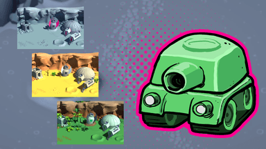

# unity_practices
practice unity

# tanks
- https://learn.unity.com/course/tanks-make-a-battle-game-for-web-and-mobile?version=6.0

# multiplayer_1
- https://docs-multiplayer.unity3d.com/netcode/current/tutorials/get-started-ngo/

# multiplayer_2
- https://unity.com/resources/ultimate-guide-advanced-multiplayer-networking
- Introduction_to_multiplayer_networking_in_Unity_e-book

# multiplayer_proto

It is the combination of the concepts of the courses (multiplayer_1, multiplayer_2) to apply them in a project similar to (tanks)

